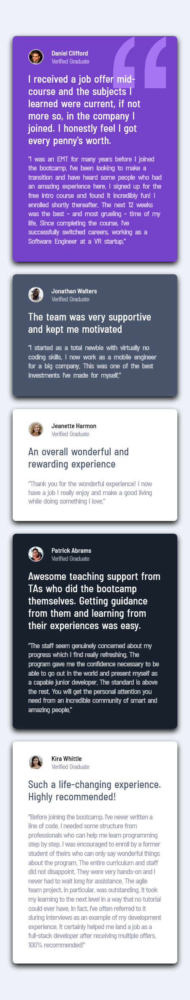

# Frontend Mentor - Testimonials grid section solution

This is a solution to the [Testimonials grid section challenge on Frontend Mentor](https://www.frontendmentor.io/challenges/testimonials-grid-section-Nnw6J7Un7). Frontend Mentor challenges help you improve your coding skills by building realistic projects. 

## Table of contents

- [Overview](#overview)
  - [The challenge](#the-challenge)
  - [Screenshots](#screenshots)
  - [Links](#links)
- [My process](#my-process)
  - [Built with](#built-with) 
- [Author](#author) 

## Overview

### The challenge

Users should be able to:

- View the optimal layout for the site depending on their device's screen size

### Screenshots

#### Desktop Design

#### Mobile Design

### Links

- Solution URL: [GitHub](https://github.com/Aimal-125/testimonials-grid.git)
- Live Site URL: [GitHub Pages](https://aimal-125.github.io/testimonials-grid/)

## My process

### Built with

- Semantic HTML5 markup
- CSS custom properties
- Flexbox
- CSS Grid
- Mobile-first workflow
- [React](https://reactjs.org/) - JS library
- [Vite](https://vitejs.dev/) - Front-End Tool

## Author

- Frontend Mentor - [@Aimal-125](https://www.frontendmentor.io/profile/Aimal-125)
- Twitter - [@aimal4910](https://www.twitter.com/aimal4910)
- LinkedIn - [@aimalkhan125](https://www.linkedin.com/in/aimalkhan125)